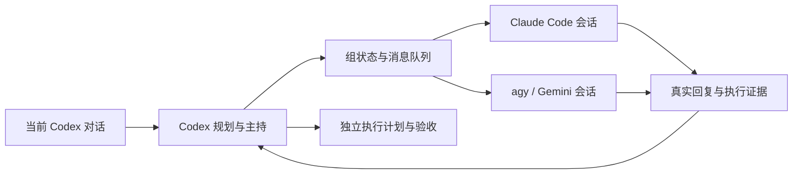

# 协作组首版实施与验证

日期：2026-09-28。实施基线：`eecfa78`。当前 Codex 对话负责主持；成员通过真实本地 CLI 逐轮调用和显式续接。此报告验证协作机制，不评价 Jev 的内容审查效果。

## 调用方式与实现

用户可直接说：

```text
$multi-harness 开一个研究组，Claude 负责调研，Gemini 负责整理，你负责计划和验收。
@研究员 解释这个结论的依据。
@编辑 根据研究员的依据整理说明。
现在进展怎么样？
暂停这个组。
继续刚才的研究组。
```

Codex 开组前确定目标、策略、角色、CLI、完整模型 ID 与验收标准。团队可保存复用，组使用配置快照。脚本不自行猜测模型或角色；当前已安装技能目录是源码的 junction，更新可直接通过 `multi-harness` 使用。



- SQLite 保存组、成员快照、对话绑定、消息与任务关联；默认位于用户本地应用数据目录。
- 点名只唤醒目标成员；状态查询不调用模型。每位成员保持独立 CLI 会话。组内串行、按需派发，没有后台常驻群聊。
- 运行期间可以排队；暂停先阻止新派发，再确认执行器停止。恢复不会重发取消、失败或结果不明的旧消息。
- 普通追问与原任务 `run/revise/accept` 独立，关联任务继续读取原始验收证据。同名或跨项目选择失败时提供候选，不猜最近的组。
- 单组默认最多 12 次尝试，可明确增加至最多 100 次；每次 dispatch 默认 1 次、最多 4 次。成员另有超时配置。

实现入口：[groups.py](../../skills/multi-harness/scripts/groups.py)、[conversation.py](../../skills/multi-harness/scripts/conversation.py)。操作契约：[groups.md](../../skills/multi-harness/references/groups.md)。

## 自动验证

通过公开组命令、真实 subprocess 和 Git 测试，仅在外部启动器边界替换合成 CLI。合成 CLI 保存并读取自己的会话状态，避免仅检查固定命令字符串。

群组测试覆盖 15 项：持久恢复和选择、消息幂等、Claude/agy 两轮续接、超时阻断、agy 范围违规、源基线漂移、执行中暂停与排队、控制器退出、已验收任务追问隔离、关联修订运行状态、团队快照、轮数上限、断流/会话变化、模型不一致、OAuth 错误展示。旧任务修订、取消与验收测试一并保留。

完整回归 **108 项通过**，耗时 129.421 秒；包含上述 15 项群组测试。修改脚本的 `py_compile`、技能 `quick_validate.py`、`git diff --check` 与新增文件空白/冲突标记检查均通过。命令：

```powershell
$env:UV_CACHE_DIR = Join-Path (Get-Location) '.cache/harness-uv-cache'
uv run --locked -m unittest discover -s tests -v
```

本次运行日志：`.cache/group-full-tests-2026-09-28.log`。合成 CLI 结果不算真实 Provider 验收。

## 真实 CLI 验证

### Gemini：通过

在独立干净 Git 夹具项目中，通过公开命令完成开组、点名、首轮读材料、暂停、状态查询、继续和第二轮改写。没有改动用户业务项目。

| 项目 | 证据 |
|---|---|
| CLI / 版本 | agy `1.2.12` |
| 指定与报告模型 | 均为 `gemini-3.8-flash-low` |
| 组 ID | `24cd6eec020b` |
| 两轮 session ID | 均为 `329a2dee-2c18-41c8-9596-f727e471acf1` |
| 第一轮 | `62b80aff431d4906a2409456d5a1782d`，1 次 `view_file`，读取 `brief.md` |
| 第二轮 | `3f2dd89422e9446e8599a6ac0aca944f`，0 次工具调用，仍保留首轮案例标签 `RIVER-42` 与合成测试限制 |
| 文件及工具范围 | 两轮均无文件变更、无范围违规；源项目保持干净 |

真实证据目录：`.cache/group-smoke-gemini-2026-09-28/`，摘要 `summary.json`，原始流、参数、每轮结果及工作区保留在其 `groups-runs/` 下。这里验证的是相同会话和前文内容的复用；未验证常驻双向通信或消息级已读 ACK。

### Claude：认证失败，未通过真实模型验收

Claude Code `2.1.274`，指定 `claude-sonnet-5`。首轮调用退出码为 1，返回：

```text
Failed to authenticate: OAuth session expired and could not be refreshed
```

CLI 错误消息的模型字段为 `<synthetic>`，不能作为真实模型身份。原始失败证据保留在 `.cache/group-smoke-2026-09-28/`，组 ID `59edf1f53eda`，轮次 `5b80a2230241409f9e58aecc3313c692`。未重试、未切换模型或修改认证；原计划的 Claude→Gemini 真实交接链没有完成。Claude 的完整会话与异常流程仅有合成 CLI 自动验证，重新登录后仍需补真实验收。

该实测暴露了错误展示问题：原来模型不一致提示掩盖了认证失败。已增加回归测试并修复：失败优先保留原始原因，成功回复仍核对模型。保存的早期失败证据不改写。

## Standards 审查

独立只读审查未发现文档化标准硬性违规。提出 1 项非阻塞维护建议：组恢复逻辑跨越会话模块边界，并重复写入会话身份格式。已由 `conversation.recover_terminal` 与 `save_identity` 统一负责，审查者复核确认建议消除。

## Spec 审查

独立只读审查提出 1 项测试缺口：缺少 agy 第二轮续接及群组超时状态测试。已补公开命令测试，审查者复核确认消除。当前无剩余审查发现。审查由 Codex 子 agent 执行，与本节的真实 CLI 验证分别记录。

## 首版限制

- 组暂停直接控制讨论调用；关联执行任务仍需 Codex 使用原 harness 取消并确认停止。
- agy 使用隔离 worktree，要求干净 Git 基线；源项目提交变化后要明确开新组，旧工作区不会自动同步。
- 未确认终止结果时，恢复核验只会标记 unknown 并停止该组，不自动重发。核对残留进程后才能明确开启新组。
- CLI 工具策略与事后范围检查不等于操作系统沙箱。没有宣称支持其他 CLI、后台自动聊天、实时打断式追加输入或已读回执。
- 实现与文档保持未提交状态，没有 commit、push 或 PR。
